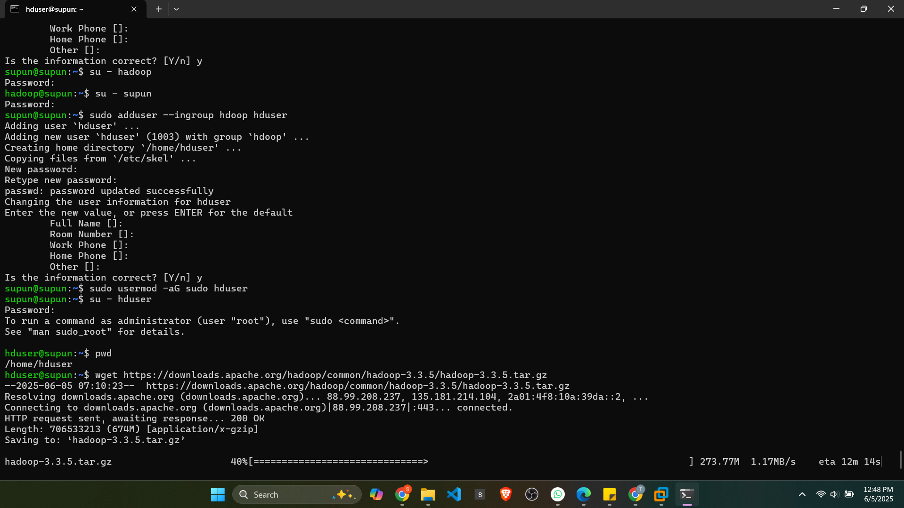
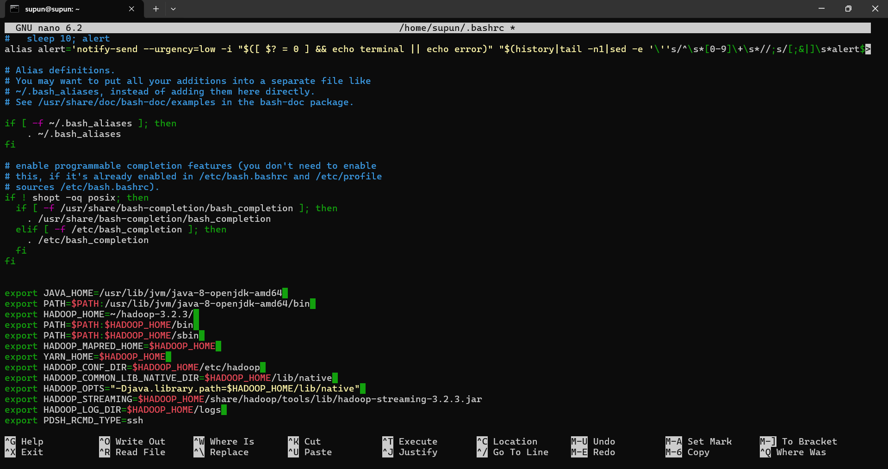

# Large-Scale Data Analysis Using MapReduce

## Assignment 1 - Semester 7
## Module: Cloud Computing (EC7205)

---

## 📌 Objective

This project implements a custom MapReduce job using Hadoop to analyze a large dataset and extract meaningful insights through distributed processing.

---

## 👨‍👩‍👧 Team Members

- Member 1 – [Jayaweera S T, EG/2020/3998]  
- Member 2 – [Gunathilake A P B, EG/2020/3947]  
- Member 3 – [Pemsiri B M P B, EG/2020/4110]

---

## 📂 Dataset

- **Dataset Name:** [e.g., Amazon Product Reviews / Synthetic Weather Logs]  
- **Source:** [Kaggle / Custom-generated]  
- **Size:** 100,000+ rows  
- **Description:**  
  > [Brief explanation of the dataset and relevance to the task.  
  If synthetic, explain how it was generated, which tools were used, and why it was structured that way.]

---

## 🧠 Problem Statement / Task

**MapReduce Task Chosen:**  
> [e.g., Product Ratings Aggregation – compute average product rating]

**Map Phase Logic:**  
> [Describe what the mapper extracts and emits]

**Reduce Phase Logic:**  
> [Describe how the reducer processes grouped data]

---

## ⚙️ Environment Setup

We used **Apache Hadoop** for local execution.

### Prerequisites

- Java 8+
- Hadoop 3.3.6
- (Optional: Python, if used for preprocessing)

### Installation

```bash
# Example commands (update with your setup)
sudo apt update
sudo apt install openjdk-8-jdk
wget https://downloads.apache.org/hadoop/common/hadoop-3.3.6/hadoop-3.3.6.tar.gz
tar -xvzf hadoop-3.3.6.tar.gz
```


### Configuring Hadoop


