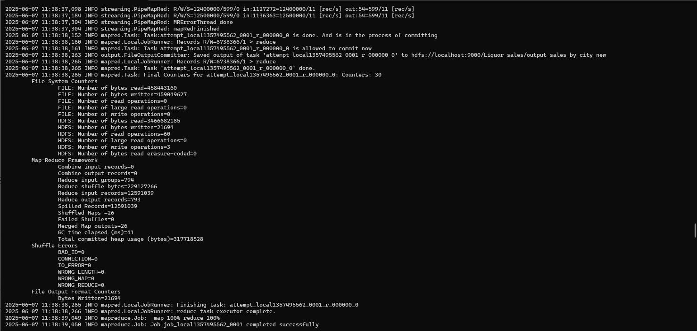

# Large-Scale Iowa Liquor Sales Data Analysis Using MapReduce

## Assignment 1 - Semester 7
## Module: Cloud Computing (EC7205)

---

## 📌 Objective

This project implements a custom MapReduce job using Hadoop to analyze a large dataset and extract meaningful insights through distributed processing.

---

## 👨‍👩‍👧 Team Members

- Member 1 – [Jayaweera S T, EG/2020/3998]  
- Member 2 – [Gunathilake A P B, EG/2020/3947]  
- Member 3 – [Pemsiri B M P B, EG/2020/4110]

---

## 📂 Dataset

- **Dataset Name:** [Iowa Liquor Sales]  
- **Source:** [Kaggle / https://www.kaggle.com/datasets/residentmario/iowa-liquor-sales]  
- **Size:** 12 million+ rows  
- **Description:**  
  > 12 million alcoholic beverage sales in the Midwest.
  > The Iowa Department of Commerce requires that every store that sells alcohol in bottled form for off-the-premises consumption must hold a class "E" liquor license (an arrangement typical of most of the state     alcohol regulatory bodies). All alcoholic sales made by stores registered thusly with the Iowa Department of Commerce are logged in the Commerce department system, which is in turn published as open data by       the State of Iowa.

---

**MapReduce Task Chosen:**  
Sales Aggregation by City – compute total sales volume per city

**Map Phase Logic:**  
The mapper extracts city names and corresponding sale amounts, emitting key-value pairs of (city, sale_amount)

**Reduce Phase Logic:**  
The reducer processes grouped data by city, summing all sale amounts to calculate total sales per city

---

## ⚙️ Environment Setup

We used **Apache Hadoop** for local execution.

### Prerequisites

- Java 8+
- Hadoop 3.3.6
- (Optional: Python, if used for preprocessing)

### Installation

```bash

sudo apt update
sudo apt install openjdk-8-jdk
wget https://downloads.apache.org/hadoop/common/hadoop-3.3.6/hadoop-3.3.6.tar.gz
tar -xvzf hadoop-3.3.6.tar.gz
```


### Configuring Hadoop


### Run Hadoop NameNode Format 


### Verify Hadoop Installation

Start Hadoop Services
Ensure Hadoop services are running before executing any job:

```bash
start-dfs.sh
start-yarn.sh
jps
```


### HDFS Web UI


### YARN Web UI


## Upload Dataset to HDFS

```bash
hadoop fs -put input/Iowa_Liquor_Sales.csv /input
```

## Run the MapReduce Job

```bash
hadoop jar $HADOOP_HOME/share/hadoop/tools/lib/hadoop-streaming-3.3.6.jar \
-mapper src/mapper.py \
-reducer src/reducer.py \
-input /input/Iowa_Liquor_Sales.csv \
-output /output_sales_by_city
```

### Running a Hadoop Streaming job using mapper.py and reducer.py on the Iowa_Liquor_Sales.csv dataset 


### Processing the Hadoop Streaming job



### Hadoop Streaming job completed successfully. Output saved to /Liquor_sales/output_sales_by_city_new. Over 12.5 million records processed with no shuffle error (both images) 


### View Output

```bash
hadoop fs -cat /output_sales_by_city/part-00000
```


