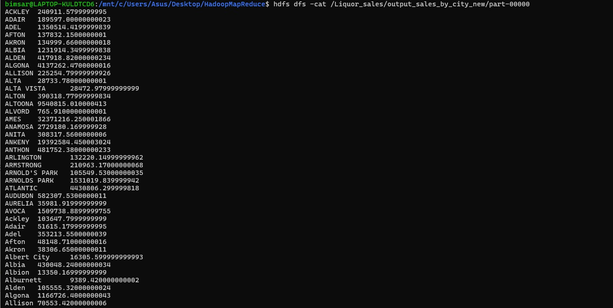

# Large-Scale Iowa Liquor Sales Data Analysis Using MapReduce

## Assignment 1 - Semester 7
## Module: Cloud Computing (EC7205)

---

## 📌 Objective

This project implements a custom MapReduce job using Hadoop to analyze a large dataset and extract meaningful insights through distributed processing.

---

## 👨‍👩‍👧 Team Members

- Member 1 – [Jayaweera S T, EG/2020/3998]  
- Member 2 – [Gunathilake A P B, EG/2020/3947]  
- Member 3 – [Pemsiri B M P B, EG/2020/4110]

---

## 📂 Dataset

- **Dataset Name:** [Iowa Liquor Sales]  
- **Source:** [Kaggle / https://www.kaggle.com/datasets/residentmario/iowa-liquor-sales]  
- **Size:** 12 million+ rows  
- **Description:**  
  > 12 million alcoholic beverage sales in the Midwest.
  > The Iowa Department of Commerce requires that every store that sells alcohol in bottled form for off-the-premises consumption must hold a class "E" liquor license (an arrangement typical of most of the state     alcohol regulatory bodies). All alcoholic sales made by stores registered thusly with the Iowa Department of Commerce are logged in the Commerce department system, which is in turn published as open data by       the State of Iowa.

---

**MapReduce Task Chosen:**  
Sales Aggregation by City – compute total sales volume per city

**Map Phase Logic:**  
The mapper extracts city names and corresponding sale amounts, emitting key-value pairs of (city, sale_amount)

**Reduce Phase Logic:**  
The reducer processes grouped data by city, summing all sale amounts to calculate total sales per city

---

## ⚙️ Environment Setup

We used **Apache Hadoop** for local execution.

### Prerequisites

- Java 8+
- Hadoop 3.3.6
- Python

### Installation

```bash

sudo apt update
sudo apt install openjdk-8-jdk
wget https://downloads.apache.org/hadoop/common/hadoop-3.3.6/hadoop-3.3.6.tar.gz
tar -xvzf hadoop-3.3.6.tar.gz
```


### Configuring Hadoop


### Run Hadoop NameNode Format 


### Verify Hadoop Installation

Start Hadoop Services
Ensure Hadoop services are running before executing any job:

```bash
start-dfs.sh
start-yarn.sh
jps
```


### HDFS Web UI


### YARN Web UI


## Upload Dataset to HDFS

```bash
hadoop fs -put input/Iowa_Liquor_Sales.csv /input
```

## Run the MapReduce Job

```bash
hadoop jar $HADOOP_HOME/share/hadoop/tools/lib/hadoop-streaming-3.3.6.jar \
-mapper src/mapper.py \
-reducer src/reducer.py \
-input /input/Iowa_Liquor_Sales.csv \
-output /output_sales_by_city
```

### Running a Hadoop Streaming job using mapper.py and reducer.py on the Iowa_Liquor_Sales.csv dataset 


### Processing the Hadoop Streaming job


### Hadoop Streaming job completed successfully. Output saved to /Liquor_sales/output_sales_by_city_new. Over 12.5 million records processed with no shuffle error (both images) 


### View Output

```bash
hadoop fs -cat /output_sales_by_city/part-00000
```




# Results and Interpretation #

This section outlines the technical approach used for the project, summarizes the findings from the data analysis, and offers an interpretation of the results.

## Approach
The primary objective of this project was to perform a large-scale data analysis using Hadoop MapReduce to determine the total liquor sales for each city from the Iowa Liquor Sales dataset.
We used Hadoop Streaming with custom Python mapper and reducer scripts to aggregate total liquor sales by city from the Iowa_Liquor_Sales.csv dataset.

The task was accomplished by following these steps:

1. **Environment Setup**: A Hadoop environment was configured on an Ubuntu Virtual Machine to process the dataset.
2. **Dataset**: The "Iowa Liquor Sales" dataset was sourced from Kaggle, containing over 37 million sales records.
3. **MapReduce Implementation**:
    - A Mapper script (mapper.py), written in Python, was developed to process the input Iowa_Liquor_Sales.csv file. The script reads each CSV line, extracts the City and Sale (Dollars) fields, and emits a key-value pair of (City, SaleAmount).
    - A Reducer script (reducer.py), also in Python, receives the intermediate data grouped by city. For each city, it sums the sales amounts to calculate the total sales. The final output is a key-value pair of (City, TotalSales).
4. **Execution**: The job was launched on HDFS. The job was executed on the Hadoop cluster using the Hadoop Streaming utility, which processed approximately 30.8 GB of data and nearly 38 million records.
    ```bash
    hadoop jar /usr/local/hadoop/share/hadoop/tools/lib/hadoop-streaming-*.jar \
    -files mapper.py,reducer.py \
    -input /liquor_sales/Iowa_Liquor_Sales.csv \
    -output /liquor_sales/output_sales_by_city_new \
    -mapper "python3 mapper.py" \
    -reducer "python3 reducer.py"
    ```
5. **Final results were inspected**:
    ```bash
    hdfs dfs -cat /liquor_sales/output_sales_by_city_new/part-00000
    ```

## Sample Results
The MapReduce job successfully aggregated the total liquor sales for every city present in the dataset. The final output provides a simple, aggregated list where each line contains a city name followed by its total sales figure.

For example, here are the first twenty lines of the output (city → total sales in USD). These results show that major cities had significantly high sales volumes:
Ankeny: $199,392,504.45
Altoona: $9,540,815.01
Ames: $32,371,216.25

The job successfully processed the full dataset, demonstrating the capability of MapReduce to handle large-scale data aggregation tasks efficiently.

## 🔍 Interpretation
### Performance & Accuracy: 
- A key observation from the output is a data cleanliness issue. 
- Duplicate city names with different letter casing (e.g., ACKLEY vs. Ackley) were treated as distinct keys.
- The aggregation resulted in separate entries for the same city (e.g., "ACKLEY" and "Ackley", or "Adair" and "adair"). 
- This means the reported sales for these cities are split and not fully aggregated.

### Data Quality Note:
- A small post-processing step to normalize casing to merge these entries for better aggregation.
- The project could be extended to perform more complex analyses like calculating the total sales per product category, aggregating sales by region , or identifying the hottest/coldest sales day per year by    incorporating date information. 

Overall, the MapReduce job completed the full dataset, demonstrating Hadoop’s scalability for aggregating tens of millions of sales records.
